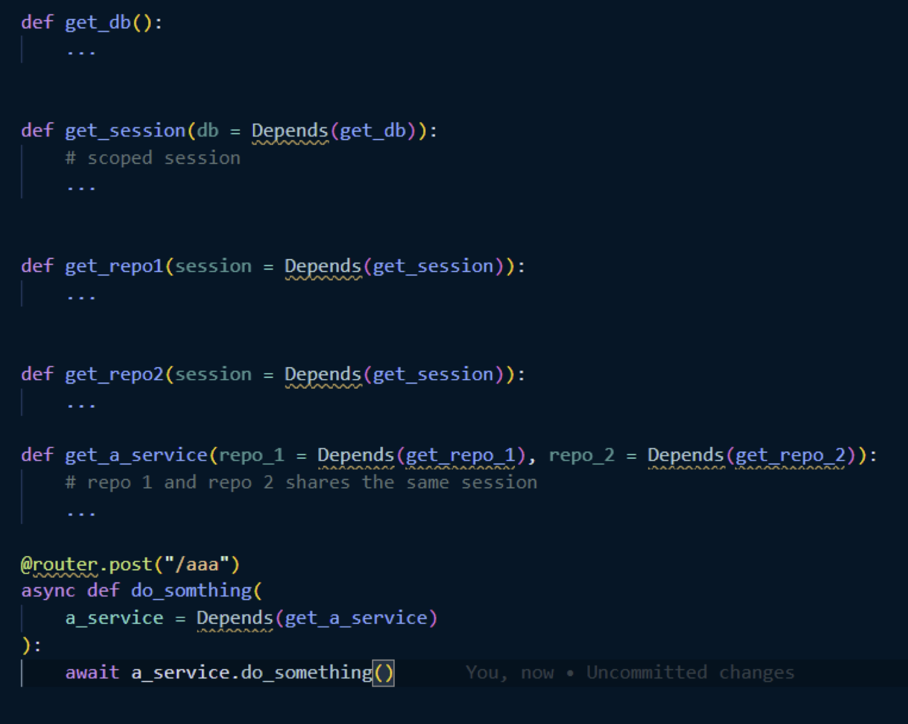
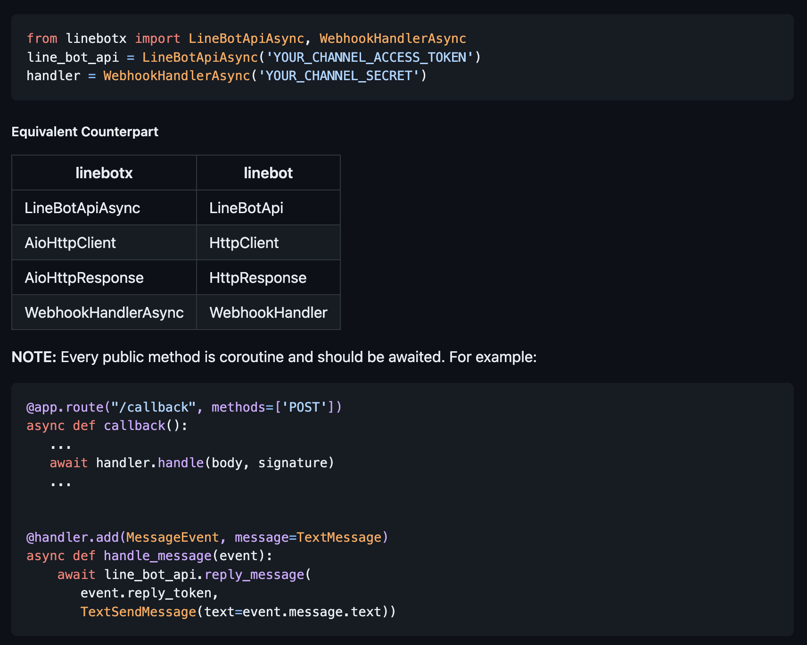
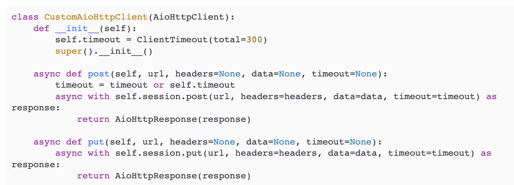

## FastAPI 사용자 모임

[FastAPI 사용자 모임](https://open.kakao.com/o/gm7tYg6c) 방에서 나온 내용 중 일부를 공유합니다.

---

### scoped_session을 사용하지 않아도 매번 session을 계속 새로 생성해서 사용하는거면 다중스레드에서도 매번 새로운 session을 만드니까 문제없는거 아닌가?

> sqlalchemy 질문이 있습니다. 
> 
> scoped_session을 사용하지 않아도 매번 session을 계속 새로 생성해서 사용하는거면 다중스레드에서도 매번 새로운 session을 만드니까 문제없는거 아닌가?
> 
> -> 놉, session객체 자체는 새로 생성하지만 멀티스레드 환경에서 동일한 데이터 영역(threading.thread)을 공유하기 때문에 문제가 생길수 있다. 그렇기 때문에 하나의 스레드당 하나의 session을 사용하는 scoped_session을 사용하자. scoped_session은 threading.local을 사용하기 떄문에 각 스레드마다 하나의 session을 보유하기 때문에 thread-safety하게 사용할 수 있다.
>
> 라고 이해 했는데 맞을까요??
>
> threading.local을 사용하기 떄문에 각 스레드마다 하나의 session을 보유하기 때문에 -> 스레드 각자의 stack 메모리 공간에 session을 만들기 때문에 thread 끼리 영향이 없음.

> 혹시나 도움이 될까 싶어… 자문자답합니다.
> 멀티 스레딩 환경에서 session이 공유되는 형태, 예를들자면 SQLAlchemy Session이 함수의 파라미터로 넘겨지는 형태에서 멀티스레딩으로 처리되는 코드가 있다고 했을때… 여러 스레드에서 동일한 session을 공유하는 형태가 되고 이때 트랜잭션 혹은 session의 commit, flush 등 동작에서 각 스레드에 영향을 주게 된다. (의도치 않은 동작 혹은 오류가 있을수 있다)
>
> 그렇기 때문에 thread-local을 사용하는 scoped_session을 사용해서 멀티스레딩 환경에서의 thread-safe를 보장한다.
>
> 만약 Session을 사용할 경우 멀티 스레딩 환경에서 Session을 하나의 스레드에서만 사용한다거나…혹은 제어 할 수 있는 로직을 짠다면 상관이 없지만 이런 부분들을 직접 제어하기 어렵다면 scoped_session을 사용하는게 좋다.
> 
> https://jay-ji.tistory.com/114

### SQLalchmey async로 통신할떄, join을 했는데, join한 테이블 데이터가 안들오는 경우가 있던데 혹시 여러분들은 관련해서 해보신 경험이 있으신가여?

> Lazyloading 사용하셨어요?

> LazyLoading 사용했습니다. (default 값으로 했네여..)

> 그 알케미 공식문서에서 orm 사용할 때는 eager loading 사용해야한다고 적혀있을거에요

> 아 진짜 좋은 힌트 감사합니다.
> 어쩐지 호출하는 에러가 떠있더라구요. 데이터 구조 뜯어보니깐.

> Select in 방식으로 조회해주시면 잘 나오실겁니다

### 최근에 SQLAlchemy를 비동기로 사용하며 발생한 문제가 하나 있어서 간략하게 포스팅으로 정리해봤습니다. https://www.hides.kr/1110

> https://docs.sqlalchemy.org/en/14/orm/extensions/asyncio.html#using-asyncio-scoped-session
> 여기 tip부분에 scoped 왠만하면 쓰지 말고 차라리 session을 직접 전달하라고 되어있네요.
> 아니면 current_task 함수를 쓰라는데 차라리 session_factory을 직접 호출해서 매번 세션 생성하는게 더 좋을지도 모르겠습니다.

> 오 쓰지말라고 나와있는건 처음봤네요. 감사합니다 :)

> 안녕하세요. 좋은 글(경험) 공유 감사합니다. 해당 글을 읽고 제 생각을 좀 정리해봤습니다. (틀린 내용이 있으시면 지적해주시면 감사하겠습니다.)
>
> 1. transaction(session)은 commit하고 나면 해당 연결을 사용할 수 없는 것이 일반적인 RDBMS의 용례인 것 같습니다.
> 
> 2. gather에서 같은 transaction을 사용하고 싶으신 것 같은데 이 때에 얻을 수 있는 장점은 사실 없을 것 같습니다. 하나의 transaction은 순차적으로 실행되는게 일반적인 것 같아요. (언어의. 특성이 아니라 DB의 특성인 것 같습니다.) - 인프랩 CTO 향로님이 js관련 작성하신 글에도 똑같은 이슈가 있어 공유합니다. (https://jojoldu.tistory.com/639)
> 
> - "위 내용을 한 문장으로 정리하면, for문으로 작업하나 Promise.all(allSettled)로 작업하나 데이터베이스의 단일 커넥션을 사용할때는 똑같은 순차 작업이 될 뿐이라는 것입니다."
> 
> 3. session per request를 하고 싶으시면, FastAPI를 사용하고 계시면, async_scoped_session을 depends에서 사용하면, 중복 사용된 session이 캐시되어 이를 구현할 수 있을 것 같습니다. (저희 팀에서는 이렇게 사용하고 있어요.). 이렇게 하면 의존성을 좀 더 명확하게 관리할 수 있어서 좋았습니다. (controller -> service -> repo 간의 의존성을 더 명확하게 사용할 수 있을 것 같습니다.)
>
> 4. Transactional 데코레이터를 여러 함수에 사용하면 코드를 읽는 사람 입장에서는 각각의 transaction이 이루어질것 으로 느껴질 것 같은데, request 한 번에 모든 함수가 transaction block에 묶인다고 이해하기 힘들 것 같다는 느낌을 받았습니다.
>
> 5. asyncio 동시 실행의 이점은 하나의 transaction에 여러 쿼리를 동시에 실행해서 얻는다기 보다는, 각각의 요청과 그로 인한 여러 transaction들이 동시에 실행됨으로써 얻을 수 있을 것 같습니다.
>
> 혹시 제가 잘못 이해한게 있을까요?

> 2. 하나의 메소드에서 실행되는 작업을 모두 하나의 트랜잭션으로 묶어주기 위함입니다. 단일 커넥션을 사용할때는 당연히 순차적으로 동작하겠지만 asyncpg에서 비동기 메커니즘을 제공해주기 때문에 하나의 세션에서 여러개의 커넥션을 가져가며 특정 커넥션 io blocking이 왔을 때 타 커넥션이 concurrency하게 수행됩니다. 문제는 제가 작성한 글에도 나와있는 것 처럼 각 작업이 처음 사용한 커넥션을 재사용하지않는다는 점입니다.
>
> 3. Depends()는 라우터에서만 동작하기에 사용하지 않았습니다. 저희는 여러 레이어로 구분되어있는 상태인데, 각 레이어마다 세션을 넘겨주는게 번거롭다고 생각하여 현재처럼 세션을 구성했습니다. 
>
> 4. 이 부분을 위해 중첩 @Transactional이 있더라도 하나로 묶는 방법을 찾다가 포스팅한 글과 같은 문제점이 발생했던거였어요. 스프링의 경우 propogation 옵션이 기본적으로 REQUIRED인데, 이런 경우 자식 트랜잭션이 부모 트랜잭션에 합류하게 됩니다. 그래서 스프링과 같은 형태로 구성하려 했던 거였고..이건 좀 더 살펴볼 예정이에요. 두 번째 방법은 Aggregate느낌의 레이어를 하나 더 분리하고 해당 레이어에서만 최상위 @Transactional을 사용하는 방법도 고려중입니다. 세부 Usecase(Service)등에는 @Transactional 데코레이터를 사용하지 않구요.
>
> 5. 말이 정확하게 이해가 안가네요 ㅎㅎ 제가 생각하는 비동기의 이점은 io blocking이 발생했을 때 제어권을 반납하여 다른 작업이 수행될 수 있다에서 나오는 성능적인 이점입니다.

> 하나의 트랙잭션에서 여러개의 connection이 나올 수 있다고 보시는 건가요? 하나의 트랜잭션 = 하나의 connection으로 보고 있는데 제가 잘못이해하고 있는지 궁금합니다. (하나의 transaction에서 nested transaction은 수행할 수 있을 것 같긴한데, 이걸 여러개의 connection이라고 봐야할지 모르겠어요.)
> 
> 저희도 여러레이어인데, service -> repo -> session로 depends를 구성하면 controller에서는 service만 주입 받고, service에서는 필요한 repo (depends 단에서), repo는 필요한 db를 받도록 구성할 수 있었습니다. 각 레이어마다 세션을 넘겨주진 않았어요!
> 
> 이건 단순히 궁금증인데, 스프링의 경우 비동기나, 멀티쓰레드로 작동하더라도 transactional이 의도한대로 작동하나요?
> 
> 제 의미는 io blocking의 제어권을 하나의 트랜잭션내에서는 얻을 수 없다는 의미었습니다. asyncio.gather를 사용하더라도 결국 하나의 transaction 내에서는 제어권을 얻지못해 순차실행 대비하여 성능적인 이점을 얻기 어렵다는 의미었어요!
>
> 
>
> 저희는 depends를 아래와 같은 의존성으로 쓰고 있긴합니다. 수도코드로 작성한거라 틀린게 있을지도 모르겠네요 ㅠㅠ

> 1. 제가 의미한 트랜잭션은 어플리케이션단의 트랜잭션이라고 보시는 게 좋을 것 같습니다. 하지만 본문에도 적어놨듯이 "여러개의 커넥션을 코드 상 트랜잭션으로 묶는 행위 또한 올바르지 않아보이기도한다" 라는 생각이 들어서요. 디비 관점에서의 트랜잭션과 커넥션은 말씀해주신게 맞습니다. 저는 어플리케이션 레벨에서 이를 통합해보려 했던건데 일단 이 부분은 저도 조금 더 고민이 필요한 부분이에요.
>
> 2. 오 저렇게 nested depends로 하면 정상적으로 주입이 되나보군요. 이건 저도 사용해보지 않았는데 테스트해봐야겠네요. 감사합니다 ㅎㅎ
>
> 3. 저도 스프링에서 비동기를 사용하지 않아서 이건 잘 모르겠네요. 멀티스레드의 경우 당연히 @Transactional 어노테이션 제대로 동작합니다. 스프링의 경우 WAS에서 다중 스레드를 띄워놓는 형태로 동작하는데 당연히 각각의 스레드는 별개이니까요.

> 답변 감사합니다! 어떤 문제를 해결하려고 하시는지 이해가 되네요. 저도 좀 더 고민해보고 괜찮은 아이디어가 나오면 공유해보겠습니다 ㅎㅎ

### Line Chatbot 공식 sdk 사용법 line-bot-sdk-python
> FastAPI + Line Chatbot을 사용하고 싶은데, Line Chatbot 공식 sdk 사용법
> 하지만 이 라이브러리는 동기적 작업만 허용하고, flask를 위한 라이브러리였다.
> 해결방법
> 1. https://github.com/Shivelight/line-bot-sdk-python-extra 이 라이브러리를 설치한다.
> 2. linebotx 라이브러리를 import 한다.
> 3. 다음과 같은 방법으로 비동기 작업을 수행한다.
> 
> 4. AioHttpClient 클래스를 상속받아서, post와 put 메소드를 오버라이딩한다.
> 
> 추가정보
> - linebotx라이브러리의 aiohttp요청 제한시간이 30초로 설정돼 있다.

### Starlette만든 encode에서 작성한 글인데 ASGI에 대해 이해하기 아주 좋은글 같아서 공유드립니다.

> - https://www.encode.io/articles/asgi-http
> - https://www.encode.io/articles/working-with-http-requests-in-asgi
> - https://www.encode.io/articles/python-async-frameworks-beyond-developer-tribalism

### 추천해주실만한 프로젝트 구조가 있을까요?

> - https://github.com/Netflix/dispatch
> - https://github.com/zhanymkanov/fastapi-best-practices

### Controller를 Class 기반으로 개발할 경우 이슈들

> 의미있을만한 내용은 아카이빙 하신다고 하셔서 혹시 Class 형식으로 개발하실 분들 위해서 해결했던 내용들은 정리하고 갈게요 !
>
> 1. FastAPI Utils는 지원종료. FastAPI Restful로 이전되어 쭉 유지보수 되고 있습니다.
> 
> 2. cbv 데코레이터를 통해서 class 기반으로 작성하시면 self 인자를 묵인 한채로 이후 인자만 체크하여 이전과 같은 함수형 개발을 하실 수 있습니다.
>
> 3. 지원중단 된 FastAPI Utils의 cbv 사용 시에는 prefix 경로가 두번 적용되는 문제가 있습니다.
> https://github.com/dmontagu/fastapi-utils/issues/154
> 
> 4. cbv의 경우 Depend를 사용한 DI에 의존합니다.
> 다른 형식으로 주입할 수 있긴 하지만 각 메소드별로 반환값에 대한 Pydantic Base모델을 상속한 Item을 각각 만들어야 합니다.

### FastAPI가 요청을 받으면 어떻게 내부에서 처리하는지

> FastAPI가 요청을 받으면 어떻게 내부에서 처리하는지 uvicorn.run(...) 부터 한줄씩 동작을 따라가며 정리한 글을 썼습니다.
>
> 디버깅 찍으면 금방 볼수 있긴하나, 따로 설명이 없기에 제가 이해하는 한도내에서 열심히 추가 코멘트를 달았습니다.
>
> https://rumbarum.oopy.io/post/examine-fastapi-handling-request-line-by-line-with-comment
> 
> 많은 응원과 피드백 부탁드립니다!
